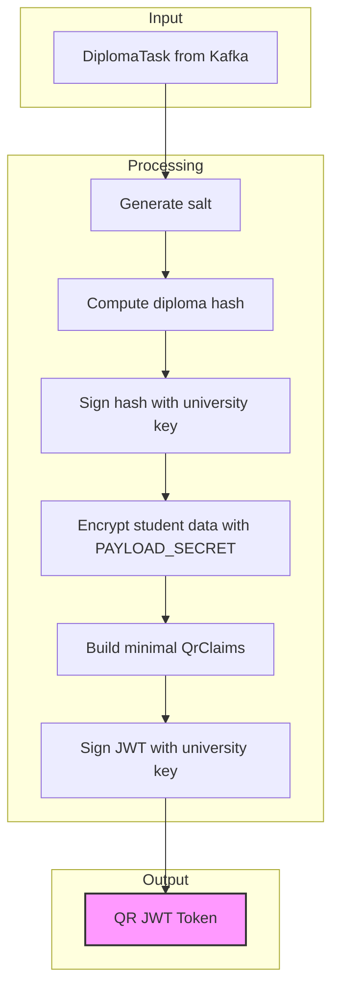
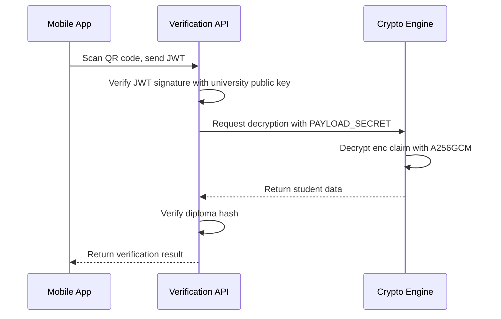

# JWT Structure Refactoring Plan

## Executive Summary

The current JWT implementation does **NOT** match the proposed structure. The key issue is that student data is stored as **plain claims** in the JWT instead of being **encrypted** inside the token.

---

## Current vs Proposed Structure

### Proposed Structure (Target)
```json
{
  "sub": "<diploma_hash>",
  "diploma_hash": "<diploma_hash>",
  "vuz_id": "<uuid>",
  "enc": "A256GCMed_content",
  "iat": 1710000000
}
```

Key characteristics:
- `enc` contains **encrypted** student data (base64-encoded A256GCM ciphertext)
- No plain student fields like `student_name`, `specialty`, `year`, etc.
- Minimal metadata: only identifiers and encrypted content

### Current Implementation

#### QrClaims (for QR codes) - Lines 124-136 in jwt.rs
```rust
pub struct QrClaims {
    pub sub: Option<String>,
    pub diploma_hash: Option<String>,
    pub vuz_id: Uuid,
    pub diploma_number: String,      // PLAIN TEXT - should be encrypted
    pub student_name: String,         // PLAIN TEXT - should be encrypted
    pub specialty: String,            // PLAIN TEXT - should be encrypted
    pub year: u16,                    // PLAIN TEXT - should be encrypted
    pub salt: String,                 // PLAIN TEXT - should be encrypted
    pub iat: u64,
    pub exp: Option<u64>,
}
```

#### ServiceClaims (for service tokens) - Lines 17-29 in jwt.rs
```rust
pub struct ServiceClaims {
    pub sub: String,
    pub diploma_hash: String,
    pub vuz_id: Uuid,
    pub enc: String,  // Currently just "A256GCM" - should be encrypted content
    pub iat: u64,
}
```

---

## Issues Found

### Issue 1: QrClaims exposes plain student data
**Location:** [`jwt.rs:124-136`](cryptography-engine-rs/src/cryptography/jwt.rs:124)

The `QrClaims` struct contains plain text student information:
- `diploma_number`
- `student_name`
- `specialty`
- `year`
- `salt`

**Problem:** Anyone who scans the QR code can decode the JWT and see all student data without any decryption key.

### Issue 2: ServiceClaims.enc is just an algorithm name
**Location:** [`jwt.rs:45`](cryptography-engine-rs/src/cryptography/jwt.rs:45)

```rust
enc: "A256GCM".to_string(),
```

**Problem:** The `enc` field should contain the actual encrypted student data, not just the algorithm name.

### Issue 3: create_service_jwe() is incomplete
**Location:** [`jwt.rs:72-90`](cryptography-engine-rs/src/cryptography/jwt.rs:72)

The function only sets `sub` and `diploma_hash` claims:
```rust
payload.set_subject(claims.sub.as_str());
payload.set_claim("diploma_hash", Some(serde_json::json!(claims.diploma_hash)))
```

Missing: `vuz_id`, `enc`, `iat`

### Issue 4: decrypt_service_jwe() expects wrong structure
**Location:** [`jwt.rs:100-121`](cryptography-engine-rs/src/cryptography/jwt.rs:100)

Tries to deserialize from a `data` claim that doesnt exist:
```rust
payload.claim("data")
```

### Issue 5: DiplomaProcessor uses QrClaims with plain data
**Location:** [`diploma.rs:189-200`](cryptography-engine-rs/src/kafka/diploma.rs:189)

```rust
let qr_claims = QrClaims {
    student_name: task.student.full_name.clone(),  // PLAIN TEXT
    specialty: task.student.specialty.clone(),      // PLAIN TEXT
    // ...
};
```

---

## Proposed Architecture

### Token Flow Diagram



### New QrClaims Structure

```rust
/// Claims for QR code JWT - minimal metadata with encrypted content.
#[derive(Debug, Clone, Serialize, Deserialize)]
pub struct QrClaims {
    /// Subject - the diploma hash
    pub sub: String,
    /// Diploma hash (same as sub for compatibility)
    pub diploma_hash: String,
    /// University ID (UUID)
    pub vuz_id: Uuid,
    /// Encrypted student data (base64-encoded A256GCM ciphertext)
    pub enc: String,
    /// Issued at timestamp
    pub iat: u64,
}
```

### Encrypted Content Structure

The `enc` field contains base64-encoded A256GCM encrypted JSON:

```json
{
  "diploma_number": "ДИП-123456",
  "student_name": "Иванов Иван Иванович",
  "specialty": "Программная инженерия",
  "year": 2024,
  "salt": "base64-encoded-salt"
}
```

---

## Implementation Plan

### Step 1: Create EncryptedStudentData struct
Create a new struct to hold the data that will be encrypted:

```rust
/// Student data that will be encrypted and stored in the `enc` claim.
#[derive(Debug, Clone, Serialize, Deserialize)]
pub struct EncryptedStudentData {
    pub diploma_number: String,
    pub student_name: String,
    pub specialty: String,
    pub year: u16,
    pub salt: String,
}
```

### Step 2: Update QrClaims
Replace the current QrClaims with the new minimal structure:

```rust
#[derive(Debug, Clone, Serialize, Deserialize)]
pub struct QrClaims {
    pub sub: String,
    pub diploma_hash: String,
    pub vuz_id: Uuid,
    pub enc: String,  // Base64-encoded A256GCM ciphertext
    pub iat: u64,
}
```

### Step 3: Create build_qr_claims function
Create a helper function that:
1. Creates `EncryptedStudentData` from student fields
2. Serializes to JSON
3. Encrypts with A256GCM using `PAYLOAD_SECRET`
4. Base64-encodes the ciphertext
5. Returns `QrClaims` with the encrypted content

```rust
pub fn build_qr_claims(
    diploma_hash: String,
    vuz_id: Uuid,
    student: &StudentFieldsForHash,
    salt: String,
    payload_secret: &[u8],
) -> AppResult<QrClaims> {
    // 1. Build encrypted data struct
    let encrypted_data = EncryptedStudentData {
        diploma_number: student.diploma_number.to_string(),
        student_name: student.full_name.to_string(),
        specialty: student.specialty.to_string(),
        year: student.year,
        salt,
    };
    
    // 2. Serialize to JSON
    let json = serde_json::to_vec(&encrypted_data)?;
    
    // 3. Encrypt with A256GCM
    let ciphertext = encrypt_with_a256gcm(&json, payload_secret)?;
    
    // 4. Base64 encode
    let enc = BASE64.encode(&ciphertext);
    
    // 5. Build claims
    Ok(QrClaims {
        sub: diploma_hash.clone(),
        diploma_hash,
        vuz_id,
        enc,
        iat: current_timestamp(),
    })
}
```

### Step 4: Create decrypt_qr_claims function
Create a helper for the verification service to decrypt:

```rust
pub fn decrypt_qr_claims(
    claims: &QrClaims,
    payload_secret: &[u8],
) -> AppResult<EncryptedStudentData> {
    // 1. Base64 decode
    let ciphertext = BASE64.decode(&claims.enc)?;
    
    // 2. Decrypt with A256GCM
    let plaintext = decrypt_with_a256gcm(&ciphertext, payload_secret)?;
    
    // 3. Deserialize
    let data: EncryptedStudentData = serde_json::from_slice(&plaintext)?;
    
    Ok(data)
}
```

### Step 5: Update DiplomaProcessor
Modify [`diploma.rs:189-202`](cryptography-engine-rs/src/kafka/diploma.rs:189) to use the new structure:

```rust
// OLD CODE:
let qr_claims = QrClaims {
    sub: Some(diploma_hash.clone()),
    diploma_hash: Some(diploma_hash.clone()),
    vuz_id: task.vuz_id,
    diploma_number: task.student.diploma_number.clone(),
    student_name: task.student.full_name.clone(),
    specialty: task.student.specialty.clone(),
    year: task.student.year,
    salt: salt.clone(),
    iat: Utc::now().timestamp() as u64,
    exp: None,
};

// NEW CODE:
let qr_claims = build_qr_claims(
    diploma_hash.clone(),
    task.vuz_id,
    &StudentFieldsForHash {
        full_name: &task.student.full_name,
        diploma_number: &task.student.diploma_number,
        specialty: &task.student.specialty,
        year: task.student.year,
    },
    salt,
    &encryption_key_bytes,
)?;
```

### Step 6: Update or remove ServiceClaims
The `ServiceClaims` and related JWE functions can be:
- **Option A:** Removed if not used elsewhere
- **Option B:** Updated to match the same pattern as `QrClaims`

### Step 7: Update tests
Update all tests in [`jwt.rs`](cryptography-engine-rs/src/cryptography/jwt.rs:212) to use the new structure.

---

## Files to Modify

| File | Changes |
|------|---------|
| [`jwt.rs`](cryptography-engine-rs/src/cryptography/jwt.rs) | Update `QrClaims`, add `EncryptedStudentData`, add helper functions |
| [`diploma.rs`](cryptography-engine-rs/src/kafka/diploma.rs) | Update to use new `build_qr_claims()` function |
| [`cryptography.rs`](cryptography-engine-rs/src/cryptography.rs) | Export new types and functions |

---

## Security Considerations

1. **PAYLOAD_SECRET must be 32 bytes** for A256GCM
2. **Each encryption uses a unique nonce** (handled by the encryption function)
3. **Verification service needs the same PAYLOAD_SECRET** to decrypt
4. **The JWT is signed** with the university's Ed25519 key for authenticity
5. **The student data is encrypted** with A256GCM for confidentiality

---

## Verification Flow



---

## Questions for Clarification

1. Should `ServiceClaims` be kept or can it be removed?
2. Is the `PAYLOAD_SECRET` the same as `encryption_key` in the current config?
3. Should the `salt` be included in the encrypted data or stored separately?
